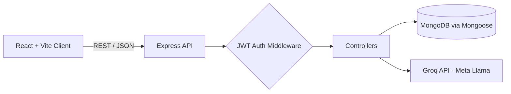

<div align="center">

# 🚀 InterviewResume

**AI-powered interview preparation platform built on the MERN stack**

Personalized interview questions and AI feedback, powered by Llama models on Groq, behind secure JWT authentication.

[](https://interview-resume-five.vercel.app)


[Live Demo](https://interview-resume-five.vercel.app) • [Features](#-features) • [Architecture](#-architecture) • [Tech Stack](#-tech-stack) • [Getting Started](#-getting-started)

</div>

---

## 📌 Overview

Interview prep is usually generic: the same question lists for everyone. **InterviewResume** lets a signed-in user get interview questions and AI feedback tailored to their own background and answers, instead of a static question bank.

The project is a full-stack MERN application with a React (Vite) client, an Express REST API, MongoDB persistence, and an LLM integration layer that calls Meta Llama models through the Groq API.

<!-- Add 2-3 screenshots or a short GIF here. Recruiters skim visuals first.

-->

## ✨ Features

| | Feature | Details |
|---|---|---|
| 🔐 | **Secure authentication** | Registration and login with JWT-based sessions; passwords hashed with bcrypt |
| 🛡️ | **Protected routes** | Auth middleware guards private API endpoints; token-based authorization on the client |
| 📄 | **Resume-based question generation** | Interview questions generated from the user's background |
| 🤖 | **AI interview assistance** | Responses and feedback generated by Llama models via the Groq API |
| 📊 | **RESTful API** | Clean controller / route / model separation on the backend |
| ⚡ | **Fast UI** | React + Vite for quick load and instant HMR in development |

## 🏗️ Architecture



**Request flow:** the client sends a request with a Bearer token → auth middleware verifies it → the controller reads or writes user data in MongoDB and, where needed, calls the Groq API → a JSON response is returned to the client.

## 💻 Tech Stack

| Layer | Technologies |
|---|---|
| **Frontend** | React.js, Vite, JavaScript (ES6+), HTML5, CSS3 |
| **Backend** | Node.js, Express.js |
| **Database** | MongoDB, Mongoose |
| **Auth & Security** | JSON Web Tokens, bcrypt |
| **AI** | Groq API, Meta Llama models |
| **Deployment** | Vercel (frontend) |

## 📂 Project Structure

```text
InterviewResume/
├── Frontend/              # React + Vite client
│   ├── public/
│   └── src/
├── Backend/               # Express API
│   ├── config/            # DB and environment setup
│   ├── controllers/       # Request handlers
│   ├── middleware/        # JWT verification
│   ├── models/            # Mongoose schemas
│   └── routes/            # API route definitions
└── README.md
```

## 🚀 Getting Started

### Prerequisites

- Node.js 18+
- A MongoDB instance (local or [MongoDB Atlas](https://www.mongodb.com/atlas))
- A [Groq API key](https://console.groq.com)

### 1. Clone the repository

```bash
git clone https://github.com/Aryan7575/InterviewResume.git
cd InterviewResume
```

### 2. Configure environment variables

Create a `.env` file inside `Backend/`:

```env
PORT=5000
MONGO_URI=your_mongodb_connection_string
JWT_SECRET=your_jwt_secret
GROQ_API_KEY=your_groq_api_key
```

### 3. Run the backend

```bash
cd Backend
npm install
npm start
```

### 4. Run the frontend (in a second terminal)

```bash
cd Frontend
npm install
npm run dev
```

## 🗺️ Roadmap

- [x] User registration and login (JWT + bcrypt)
- [x] Protected routes
- [x] AI-generated interview questions and responses (Groq + Llama)
- [ ] Resume file upload and parsing
- [ ] Mock interview sessions
- [ ] AI performance scoring
- [ ] Interview history
- [ ] Email verification and password reset
- [ ] Admin dashboard

## 👨‍💻 Author

**Aryan Vishwakarma**
B.Sc. Computer Science Graduate · Full Stack (MERN) Developer

Building web applications and integrating AI into everyday software.

[GitHub](https://github.com/Aryan7575) • [Live Demo](https://interview-resume-five.vercel.app)

---

<div align="center">⭐ If you found this project useful, consider giving it a star!</div>
